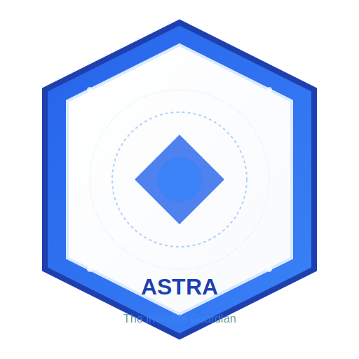

# 🛡️ ASTRA: The Invisible Guardian

> **Core Philosophy:** The best security is the security you never notice.



ASTRA is a revolutionary security framework that operates on a 5-tier friction model, where 95% of users experience Tier 0-1 (invisible to near-invisible), and only obvious threats hit higher tiers.

**Think Cloudflare, but better.** ASTRA combines gateway security checks, continuous hijack detection, and AI-resistant humanity verification into a seamless user experience.

## The Friction Spectrum: Zero to Minimal

| Tier | Experience | User Feels When Triggered | OOS Range |
|------|------------|---------------------------|-----------|
| 0 - Ghost | Nothing | Normal browsing | 0.0-1.5 |
| 1 - Whisper | 200ms micro-delay | "Page loaded slightly slow" | 1.5-2.0 |
| 2 - Nudge | Single intuitive gesture | "Oh, that was quick" | 2.0-2.5 |
| 3 - Pause | 10-second engaging challenge | "Minor inconvenience" | 2.5-3.0 |
| 4 - Gate | Manual review queue | "Security check" (rare) | 3.0+ |

**Goal:** 95% of humans never leave Tier 0-1. Bots never get past Tier 2.

## Key Features

### 🎭 The "Good" Factor: Delightful Security
Security that feels helpful, not hostile.

### 🔄 Hourly Mutation
Prevents user fatigue and makes attacks impossible through constantly evolving challenges.

### ♿ Accessibility First
Security for everyone, with adaptations for motor disabilities, visual impairments, cognitive disabilities, and assistive tech users.

### 📊 "Good" Metrics
Tracks user happiness alongside security with targets for time to verify (<3s for 95%), completion rate (>99%), and user satisfaction (>4.5/5).

## Project Structure

- `src/core/` - Core security engine and OOS (Out-of-Session) scoring
- `src/tiers/` - Implementation of all 5 friction tiers
- `src/challenges/` - Physical challenge implementations (Pulse, Tilt, Breath, Flick)
- `src/mutation/` - Hourly mutation system and challenge scheduling
- `src/accessibility/` - Accessibility adaptations and alternative verification paths
- `src/metrics/` - User happiness and security metrics tracking
- `docs/` - Comprehensive documentation
- `tests/` - Test suites for all components
- `examples/` - Real-world implementation examples

## Quick Start

```bash
# Clone the repository
git clone https://github.com/yourusername/astra.git

# Install dependencies
cd astra
npm install

# Run tests
npm test

# Start development server
npm run dev
```

## Real-World Scenario: Shopping Checkout

**User:** Sarah, buying shoes on her phone during lunch break.

**ASTRA's invisible work:**
1. Page load: Hardware breath confirmed from her holding the phone (Tier 0)
2. Browsing: Frequency mapping shows natural scroll-pause-click patterns (Tier 0)
3. Add to cart: Whisper layer adds 100ms to button response, confirms biological timing (Tier 1—invisible)
4. Checkout: New device detected (work phone vs. home phone), OOS rises to 2.2
5. Challenge: "The Pulse"—tap with the vibration (3 seconds, satisfying haptic feedback)
6. Success: "You're all set!" (immediate redirect to payment)

**Total friction:** 3 seconds, felt like a micro-interaction, not security

## The "Good" Security Manifesto

| Bad Security (Current CAPTCHA) | Good Security (ASTRA) |
|--------------------------------|-----------------------|
| Punishes everyone for bot threats | Protects silently, interrupts rarely |
| Visual puzzles that AI solves better than humans | Physical challenges only biology can pass |
| Static, hated, fatiguing | Mutating, novel, engaging |
| "Prove you're human" (accusatory) | "Quick tap to continue" (inviting) |
| Binary: pass/fail, go away | Graduated: whisper, nudge, pause, gate |
| Ignores accessibility | Adapts to human diversity |
| Security team vs. Users | Security team for Users |

## License

MIT

---

ASTRA isn't a wall. It's a doorman who knows your face, opens the door before you reach it, and only asks for ID if you're wearing a mask—and even then, apologizes for the inconvenience.
